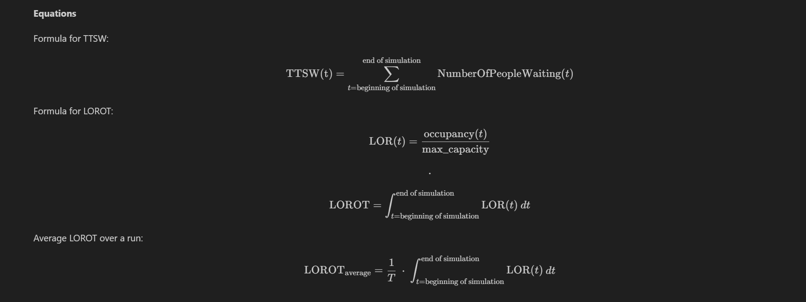
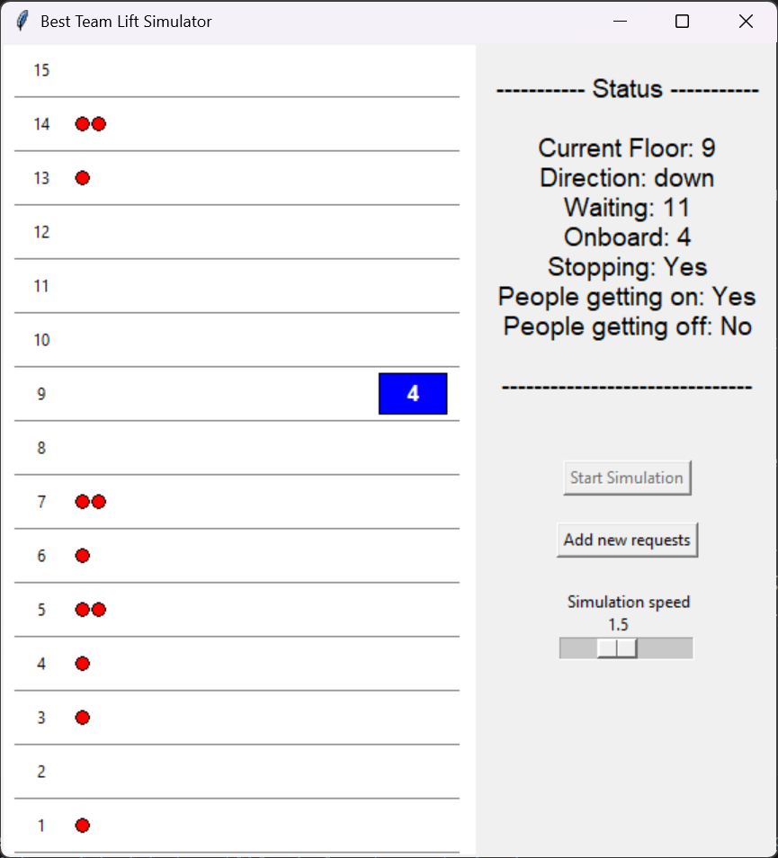
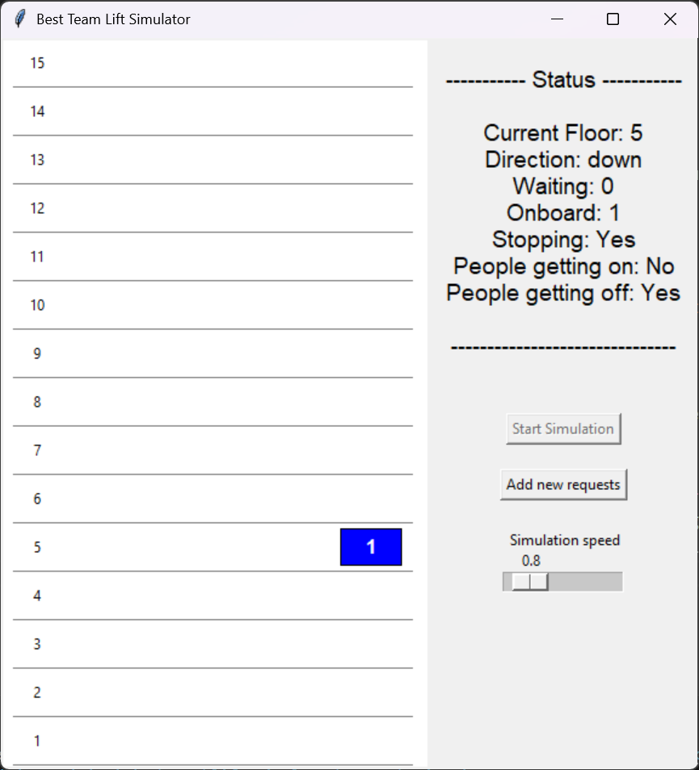

# Table of contents

- ## [1) Project overview and features](#1-project-overview-and-features-1)
    - [a) Overview](#a-overview)
    - [b) Features](#b-features-implemented)
    - [c) Assumptions / limitations](#c-assumptions-and-limitations)

- ## [2) Usage instructions](#2-usage-instructions-1)
    - [a) Requirements](#a-requirements)
    - [b) Configuration instructions](#b-configuration-instructions)
    - [c) Build](#c-build)

- ## [3) Performance analysis](#3-performance-analysis-1)
    - [a) Overview](#a-overview)
    - [b) Parameters](#b-parameters)
    - [c) Testing methodology](#c-testing-methodology)
    - [d) Output format and generating graphs](#d-output-format-and-generating-graphs)

- ## [4) Demo screenshots](#4-demo)


---


# 1) Project overview and features

### a) Overview
This project is a lift simulator.  
In a building with a configurable number of floors, requests are made, and the lift moves appropriately to serve them.  

### b) Features implemented
- custom lift algorithm
- configuration settings:
    - custom number of floors in the building
    - custom number of initial requests
    - custom lift capacity
- GUI:
    - real time status updates
    - visualisation for waiting requests
    - add requests in real time
    - simulation speed slider
- rigorous testing with random variables
- graphs for performance analysis


### c) Assumptions and limitations
- floors are discrete: the lift "teleports" from one floor to the next
- lift knows whether a request is upbound or downbound (this is realistic, one could imagine that when calling the lift you have 2 buttons)
- it takes the same amount of time for 1 person to get off the lift as it does for 10 (this is more unrealistic, avenue for improvement in the future)
- not implemented multiple lifts per building


# 2) Usage instructions

## a) Requirements

The project runs on Python 3.13.  
The GUI (graphical user interface) requires the Python module tkinter. This library is included by default with Python.


## b) Configuration instructions

The program requires a configuration file, where the user provides parameters for the program.  

These should be included in a `config.json` file, located at `/sources/config.json`.  

Here is an example file; the formatting should look like the following:  
```
{
    "total_floors": 10,
    "capacity": 5,
    "num_requests": 30
}
```
The file must be a valid json file.  

- `total_floors` parameter specifies the number of floors in the building. **Note:** this value must be **strictly greater than 1** to be valid (explanation: a building with 1 floor does not require a lift, and a building with 0 or negative floors does not make sense).  
- `capacity` parameter denotes the capacity of the lift, measured as x number of people. In the example file, the lift has a maximum capacity of 5 people. **Note:** this value must be **strictly greater than 0** (explanation: a lift with a capacity of 0 people does not make sense, and idem for negative capacity).
- `num_requests` parameter specifies the number of requests (people wanting to go to a different floor) to be simulated. Additional requests can be added by the user through the GUI once the simulation is running.    

If the user **fails to provide** any of the above parameters, they will be replaced by a default value.  
If the user **specifies a negative number** for any of the above parameters, our code will raise a ValueError, with an appropriate message. (Note that number of floors must be > 1, as a building with 1 floor would not have a lift system.)  


## c) Build

The entry point for the program is `sources/main.py`.  
To run the code directly from the command line, use
```
python ./sources/main.py
```


# 3) Performance analysis

### a) Overview  
We performed rigorous analysis of our lift system's performance. We made use of test scripts, which repeatedly simulated the lift operation, while randomly varying parameters such as floor count, lift capacity, and number of requests.  
We systematically saved the results of our simulations in csv files, which are located in the `results/data/` directory.  
Accross different simulation runs, the parameters that we varied were the ones present in the config.json file, in other words:
- Number of floors in the building
- Maximum capacity of the lift 
- Number of requests
In the following subsections, when we refer to "varying parameters", we are referring to the 3 above.

### b) Parameters

We measured the performance of the lift using 3 output values:
- **Moves**: represents the number of moves the lift has to make over time.  
For examplemoving from floor 2 to floor 5 corresponds to 3 moves; moving from floor 1 to floor 6, then down to floor 3, corresponds to 5+3 = 8 moves.
- **TTSW**: TTSW stands for Total Time Spent Waiting.  
This variable accumulates the sum of waiting requests at each simulation step.  
At every iteration of the simulation loop, the number of waiting requests is added to `ttsw`. Since each simulation step represents one unit of time, TTSW is a good metric for waiting time experienced by all passengers in the simulation.
A higher `ttsw` value indicates that, on average, passengers waited longer before being served.  
The higher the TTSW, the more waiting has happened. 
- **LOROT**: LOROT stands for Lift Occupancy Ratio Over Time.  
This variable represents the occupancy ratio of the lift (how full it is) over time. On one hand, this ratio being low means the lift has more available capacity at any given moment, which would imply we would want to minimise it, vis-a-vis lift availability. On the other hand, maximising this variable means the lift is carrying as close as possible to its maximum capacity, which implies the lift is operating more efficiently.

**Equations**  




### c) Testing methodology

In order to generate our result data, we used various testing scripts. The methodology behind these scripts was that we would examine the effects of varying different parameters on Moves / TTSW / LOROT.  
We achieved this by setting 2 of the 3 parameters to constants, then randomly varying the 3rd over many repeated simulations. We saved the results to csv files, and generated graphs based on those.  

### d) Output format and generating graphs

Our output data is in csv format, and available in the `results/data/` directory.  
We generated our graphs using conventional python libraries (pandas, numpy, matplotlib, seaborn).  
The graphs generated from our data are available in the `results/charts/` directory. Some are also included within our report.


# 4) Demo



