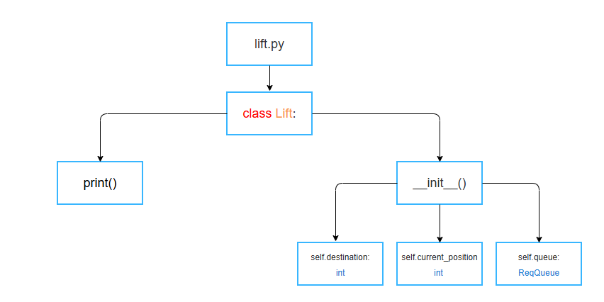
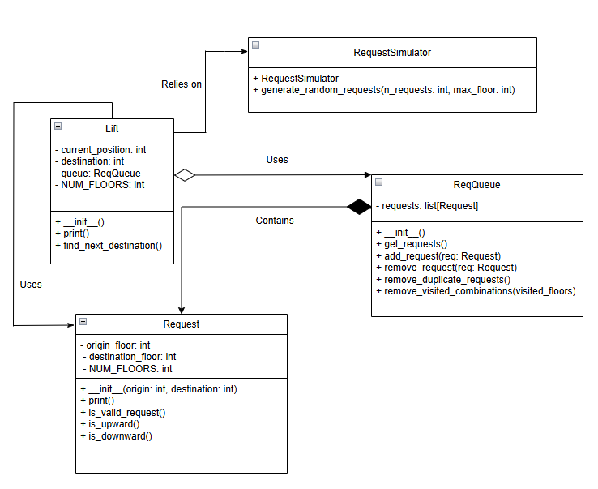

# Documentation for the Lift manager


# Table of contents

- ## [1) Project overview and features](#1-project-overview-and-features-1)

- ## [2) Usage instructions](#2-usage-instructions-1)
    - [a) Requirements](#a-requirements-1)
    - [b) Configuration instructions](#b-configuration-instructions-1)
    - [c) Build](#c-build-1)

- ## [3) Performance analysis](#3-performance-analysis-1)
    - [a) Overview](#a-overview)
    - [b) Parameters](#b-parameters)
    - [c) Testing methodology](#c-testing-methodology)
    - [d) Output format and generating graphs](#d-output-format-and-generating-graphs)
    - [e) Interpretation of results](#e-interpretation-of-results)

- ## [4) Code documentation](#4-code-documentation-1)

- ## [5) Screenshots and demo](#5-screenshots-and-demo-1)

---


# 1) Project overview and features

**Features we implemented**:
- custom, efficient lift algorithm
- GUI, with real-time status updates
- rigorous testing with random variables
- graphs for performance analysis
- defensive programming for configuration settings


# 2) Usage instructions

## a) Requirements

The project runs on Python 3.13.  
The GUI (graphical user interface) requires the Python module tkinter. This library can be installed using 
```
pip install tk
```


## b) Configuration instructions

The program requires a configuration file, where the user provides parameters for the program.  

These should be included in a `config.json` file, located at `/sources/config.json`.  

Here is an example file; the formatting should look like the following:  
```
{
    "total_floors": 10,
    "capacity": 5,
    "num_requests": 30
}
```
The file must be a valid json file.  

- `total_floors` parameter specifies the number of floors in the building. **Note:** this value must be **strictly greater than 1** to be valid (explanation: a building with 1 floor does not require a lift, and a building with 0 or negative floors does not make sense).  
- `capacity` parameter denotes the capacity of the lift, measured as $x$ number of people. In the example file, the lift has a maximum capacity of 5 people. **Note:** this value must be **greater than or equal to 0** (explanation: a lift with a capacity of 0 people does not make sense, and idem for negative capacity).
- `num_requests` parameter specifies the number of requests (people wanting to go to a different floor) to be simulated. This value will affect both main.py and gui.py entry points.  

If the user **fails to provide** any of the above parameters, they will be replaced by a default value.  
If the user **specifies a negative number** for any of the above parameters, our code will raise a ValueError, with an appropriate message. (Note that number of floors must be > 1, as a building with 1 floor would not have a lift system.)  


## c) Build

The entry point for the program is `sources/main.py`.  
To run the code directly from the command line, use
```
python ./sources/main.py
```


# 3) Performance analysis

### a) Overview  
We performed rigorous analysis of our lift system's performance. We made use of test scripts, which repeatedly simulated the lift operation, while randomly varying parameters such as floor count, lift capacity, and number of requests.  
We systematically saved the results of our simulations in csv files, which are located in the `results/data/` directory.  
Accross different simulation runs, the parameters that we varied were the ones present in the config.json file, in other words:
- Number of floors in the building
- Maximum capacity of the lift 
- Number of requests
In the following subsections, when we refer to "varying parameters", we are referring to the 3 above.

### b) Parameters

We measured the performance of the lift using 3 output values:
- **Moves**: represents the number of moves the lift has to make over time.  
For examplemoving from floor 2 to floor 5 corresponds to 3 moves; moving from floor 1 to floor 6, then down to floor 3, corresponds to 5+3 = 8 moves.
- **TTSW**: TTSW stands for Total Time Spent Waiting.  
This variable accumulates the sum of waiting requests at each simulation step.  
At every iteration of the simulation loop, the number of waiting requests is added to `ttsw`. Since each simulation step represents one unit of time, TTSW is a good metric for waiting time experienced by all passengers in the simulation.
A higher `ttsw` value indicates that, on average, passengers waited longer before being served.  
The higher the TTSW, the more waiting has happened. 
- **LOROT**: LOROT stands for Lift Occupancy Ratio Over Time.  
This variable represents the occupancy ratio of the lift (how full it is) over time. On one hand, this ratio being low means the lift has more available capacity at any given moment, which would imply we would want to minimise it, vis-a-vis lift availability. On the other hand, maximising this variable means the lift is carrying as close as possible to its maximum capacity, which implies the lift is operating more efficiently.

**Equations**  

Formula for TTSW:  
$$
\text{TTSW(t)} = \sum_{t = \text{beginning of simulation}}^{\text{end of simulation}}{\text{NumberOfPeopleWaiting}(t)}
$$
  
Formula for LOROT:  
$$
\text{LOR}(t) = \frac{\text{occupancy}(t)}{\text{max\_capacity}}
$$

$$
\cdot
$$


$$
\text{LOROT} = \int_{t = \text{beginning of simulation}}^{\text{end of simulation}}{\text{LOR}(t)}\:dt
$$
  
Average LOROT over a run:
$$
\text{LOROT}_{\text{average}} = \frac{1}{T} \: \cdot \: \int_{t = \text{beginning of simulation}}^{\text{end of simulation}}{\text{LOR}(t)}\:dt
$$  


### c) Testing methodology

In order to generate our result data, we used various testing scripts. The methodology behind these scripts was that we would examine the effects of varying different parameters on Moves / TTSW / LOROT.  
We achieved this by setting 2 of the 3 parameters to constants, then randomly varying the 3rd over many repeated simulations. We saved the results to csv files, and generated graphs based on those.  

### d) Output format and generating graphs

Our output data is in csv format, and available in the `results/data/` directory.  
We generated our graphs using conventional python libraries (pandas, numpy, matplotlib, seaborn).  
The graphs generated from our data are available in the `results/charts/` directory. Some are also included within our report.


# 4) Code documentation

- **Lift Class (lift.py)**:



This class manages the lifts operations, including its movement, request queue, and the people inside. It uses attributes such as: current_floor (the current floor the lift is at); capacity (the max number of people the lift can hold); onboard_requests (a list of requests currently in the lift); and request_queue (a queue for handling requests outside of the lift). The methods for this class are as follows: add_requests (adds a new request to the lifts reqeust queue); move (moves the lift to the next requested floor based on its direction); and get_current_direction (determines wether the lift is moving up or down). 

- **Request Class (request.py)**:


This class represents each individual lift request, a request indicates a call to the lift from an origin floor to a destination floor. The attributes used are: origin_floor (the floor where the request originated); destination_floor (the target floor for the lift); and picked_up (a flag indicating whether the request has been fulfilled). The methods utilised are: is_valid_request (checks if the request is valid, ensuring both floors are within range and not the same); is_upward (checks if the request is for an upward movement); is_downward (checks if the request is for a downward movement); and __repr__ (returns a string representation of the request, displaying its status as either waiting or picked up).

- **Request Queue Class (req_queue.py)**:


This class implements a queue system for managing lift requests associated with a particular lift instance. It imports the Request class from request.py, which defines individual lift requests and their attributes. The primary attribute is requests, a list that stores active requests as instances of the Request class. The methods used include: add_request (adds a new request to the queue); remove_request (removes a specific request if it exists in the queue); remove_duplicate_requests (eliminates requests with the same origin and destination to prevent duplication); remove_served_requests (removes requests that have already been fulfilled by checking the order in which floors were visited); and __repr__ (returns a string representation of the queue, displaying the current pending requests).

- **Request Simulator Class (request_simulator.py)**:

This class represents the individual lift requests, made from a specific floor to another. Attributes used are: origin_floor (the floor where the request originated); destination_floor (the target floor for the lift); and picked_up (a flag indicating wether a request has been fulfilled). The methods utilised are: is_valid_request (checks if the request is valid (e.g, floors must be within range and cannot be the same)); is_upward (checks if the reqeut is for an upward movement); and is_downward (checks if the request is for a downward movement).

- **GUI class (gui.py)**:

This class manages the user interface for simulating the lift's behaviour using the tkinter library. It uses the following attributes: master (the root window of the GUI); config (configuration settings loaded from a JSON floor I(e.g., total floors)); lift (an instance of the lift class); requests (list of generated requests for the simulation); canvas (the canvas where the building and lift are drawn); start_button (the button to start the simulation); and status_label (a label to display the status of the simulation). The methods used within this class are: init (initialises the GUI, loads config, creates the lift object and prepares the canvas); draw_building (draws the bjuilding layout, including the floors and floor numbers); update_lift_position (updates the position of the lift on the canvas as it moves); update_waiting_indicators (draws circles representing people waiting at each floor); simulation_step (advances the simulation by one step, moving the lift and updating the display); and start_simulation (starts the simulation and disables the start button to prevent multiple starts).

- **UML Diagram**:



This UML diagram is a visual representation of the structure of the lift system, -- leaving the rest of the explanation for now as it's likely that i'll need to change the UML diagram in the future. :D


# 5) Screenshots and demo

TODO: we should complete this later, when the project is almost finished.

